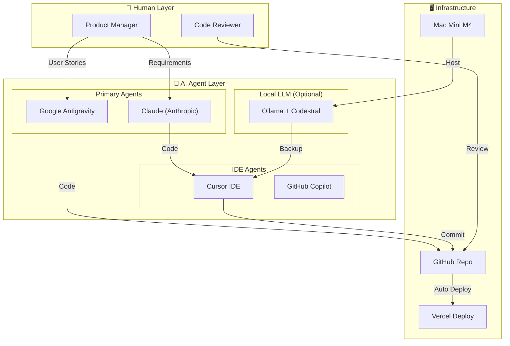
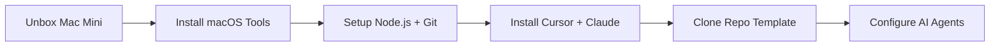
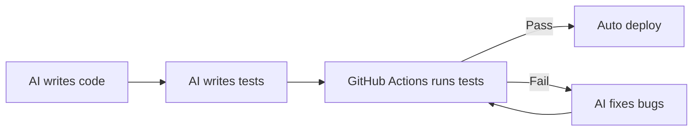

# AI Agent-First Development Blueprint

**Project:** MATE - Hệ sinh thái hỗ trợ tự học tiếng Anh  
**Version:** 1.0  
**Date:** 2026-02-02  
**Author:** Solution Architect (AI Agent Specialist)

---

## 1. Tổng quan Mô hình (Overview)

### 1.1 Triết lý

> **"AI làm code, Human làm brain"**  
> AI Agents đảm nhiệm 80% công việc coding. Con người tập trung vào strategy, review, và creative decisions.

### 1.2 Kiến trúc AI Agent Stack



---

## 2. Thiết bị & Phần mềm (Hardware & Software)

### 2.1 Hardware Setup

| Thiết bị          | Specs               |  Giá (USD) | Vai trò                                     |
| :---------------- | :------------------ | ---------: | :------------------------------------------ |
| **Mac Mini M4**   | 24GB RAM, 512GB SSD |       $800 | AI Agent Server, Local LLM, Dev Environment |
| Monitor 24"       | 1080p/4K            |       $150 | Màn hình làm việc                           |
| Keyboard + Mouse  | Wireless            |        $50 | Input devices                               |
| **Tổng Hardware** |                     | **$1,000** |                                             |

### 2.2 Software Stack

| Phần mềm             | Vai trò           | Chi phí/tháng |
| :------------------- | :---------------- | ------------: |
| **macOS Sequoia**    | Operating System  | $0 (included) |
| **Xcode CLI Tools**  | Development tools |            $0 |
| **Node.js 20 LTS**   | Runtime           |            $0 |
| **Docker Desktop**   | Containerization  |            $0 |
| **VS Code / Cursor** | IDE               |      $0 / $20 |
| **Git + GitHub**     | Version Control   |            $0 |

### 2.3 AI Agent Subscriptions

| Service                    | Plan          | Chi phí/tháng | Vai trò                                |
| :------------------------- | :------------ | ------------: | :------------------------------------- |
| **Claude Pro** (Anthropic) | Pro           |           $20 | Primary coding agent, complex logic    |
| **Cursor Pro**             | Pro           |           $20 | IDE-integrated coding, fast iterations |
| **OpenAI API**             | Pay-as-you-go |        $30-50 | Production AI (Speaking feedback)      |
| **GitHub Copilot**         | Individual    |           $10 | Code suggestions, autocomplete         |
| **Ollama** (Local)         | Free          |            $0 | Backup, offline coding                 |
| **Tổng AI Services**       |               |   **$80-100** |                                        |

---

## 3. Chi phí Chi tiết (Detailed Cost Breakdown)

### 3.1 CAPEX (Chi phí một lần)

| Hạng mục                            | Chi tiết           |    Chi phí |
| :---------------------------------- | :----------------- | ---------: |
| **Hardware**                        |                    |            |
| - Mac Mini M4                       | 24GB/512GB         |       $800 |
| - Monitor + Accessories             |                    |       $200 |
| **Subtotal Hardware**               |                    | **$1,000** |
|                                     |                    |            |
| **AI Services Setup**               |                    |            |
| - Claude Pro (2 tháng)              | $20 x 2            |        $40 |
| - Cursor Pro (2 tháng)              | $20 x 2            |        $40 |
| - OpenAI Credits                    | Initial deposit    |        $50 |
| - GitHub Copilot (2 tháng)          | $10 x 2            |        $20 |
| **Subtotal AI**                     |                    |   **$150** |
|                                     |                    |            |
| **Human Resources**                 |                    |            |
| - Technical PM (Part-time, 4 weeks) | 10h/week x $12.5/h |       $500 |
| - Content Creator (Audio/Cards)     | Project-based      |       $300 |
| **Subtotal Human**                  |                    |   **$800** |
|                                     |                    |            |
| **Miscellaneous**                   |                    |            |
| - Domain (.com)                     | 1 year             |        $12 |
| - Contingency (5%)                  |                    |      ~$100 |
| **Subtotal Misc**                   |                    |   **$112** |
|                                     |                    |            |
| **TỔNG CAPEX**                      |                    | **$2,062** |

### 3.2 OPEX (Chi phí vận hành hàng tháng)

| Hạng mục                          |     Chi phí/tháng |
| :-------------------------------- | ----------------: |
| Electricity (Mac Mini ~50W x 24h) |                $5 |
| Internet (Static IP)              |               $15 |
| AI Services (Production)          |            $30-50 |
| Vercel Hosting                    |             $0-20 |
| Supabase (Database)               |             $0-25 |
| **Tổng OPEX**                     | **$50-115/tháng** |

---

## 4. Workflow Chi tiết (Development Workflow)

### 4.1 Phase 0: Setup (Day 1-2)



**Checklist:**

- [ ] Setup Mac Mini M4
- [ ] Install Homebrew, Node.js 20, Git
- [ ] Install Cursor IDE, đăng nhập Claude
- [ ] Clone Next.js template
- [ ] Configure `.env` với API keys
- [ ] Test AI Agent connection

### 4.2 Phase 1: Core MVP (Week 1-2)

| Task         | AI Agent           | Human            | Output                    |
| :----------- | :----------------- | :--------------- | :------------------------ |
| PWA Setup    | Antigravity/Claude | Review           | Next.js + PWA config      |
| Auth System  | Cursor + Claude    | Test login       | Supabase Auth integration |
| QR Scanner   | Claude             | Test on mobile   | Camera + QR decode        |
| Flashcard UI | Cursor             | Review design    | Card components           |
| Media Player | Claude             | Test audio/video | Player component          |

**Daily Workflow:**

```
Morning (2h):
├── PM writes task requirements (User Story format)
├── Feed to Claude/Antigravity
└── AI generates initial code

Afternoon (2h):
├── Code review by PM
├── Request fixes via Cursor
├── AI iterates until approved
└── Commit & Push to GitHub

Evening (Auto):
├── Vercel auto-deploys
├── PM tests on staging
└── Log issues for next day
```

### 4.3 Phase 2: AI Features (Week 3)

| Task                   | AI Agent | Challenge             | Solution                          |
| :--------------------- | :------- | :-------------------- | :-------------------------------- |
| Speech Recognition     | Claude   | Browser compatibility | Web Speech API + Whisper fallback |
| Traffic Light Feedback | Cursor   | UX animation          | Framer Motion                     |
| Virtual Partner        | Claude   | Turn-taking logic     | State machine                     |

### 4.4 Phase 3: Gamification (Week 4)

| Task               | AI Agent | Notes                    |
| :----------------- | :------- | :----------------------- |
| Postcard Generator | Claude   | Canvas API + html2canvas |
| Growth Tree        | Cursor   | SVG animation            |
| Progress Tracking  | Claude   | Supabase + localStorage  |

### 4.5 Phase 4: Testing & Launch (Day 25-30)

| Task               | Responsibility           |
| :----------------- | :----------------------- |
| PWA Offline Test   | Human (PM)               |
| Cross-browser Test | AI Agent (automated)     |
| Bug Fixes          | AI Agent + Human review  |
| Performance Audit  | Lighthouse + AI analysis |
| Go Live            | Human approval           |

---

## 5. Phân công Vai trò (Roles & Responsibilities)

### 5.1 AI Agents

| Agent                  | Vai trò chính                         | Best for                          |
| :--------------------- | :------------------------------------ | :-------------------------------- |
| **Claude (Anthropic)** | Kiến trúc, logic phức tạp, debugging  | System design, API integration    |
| **Cursor**             | Coding nhanh, UI components           | React/Next.js, refactoring        |
| **Antigravity**        | Full project context, file management | Multi-file changes, documentation |
| **GitHub Copilot**     | Autocomplete, snippets                | Boilerplate code                  |
| **Ollama (Local)**     | Offline backup, privacy-sensitive     | When internet down                |

### 5.2 Human (Part-time PM)

| Trách nhiệm                      |  Thời gian/ngày   |
| :------------------------------- | :---------------: |
| Viết requirements (User Stories) |      30 min       |
| Review code từ AI                |     1-2 hours     |
| Test features trên staging       |      30 min       |
| Communicate với stakeholder      |      30 min       |
| **Tổng**                         | **2-3 hours/day** |

---

## 6. Quality Assurance (QA Process)

### 6.1 Automated Testing (AI-generated)



**Test Stack:**

- Unit Tests: Vitest
- E2E Tests: Playwright
- CI/CD: GitHub Actions

### 6.2 Human Review Checklist

Before each merge:

- [ ] Code readable and maintainable?
- [ ] No hardcoded secrets/keys?
- [ ] Mobile responsive?
- [ ] Accessibility (a11y) basics?
- [ ] Performance acceptable?

### 6.3 AI Self-Review Prompt

```markdown
Review this code for:

1. Security vulnerabilities
2. Performance issues
3. Best practices violations
4. Missing error handling
5. Accessibility issues

Suggest fixes for any issues found.
```

---

## 7. Prompt Templates (For AI Agents)

### 7.1 Feature Development

```markdown
# Context

Project: MATE - English Learning PWA
Tech Stack: Next.js 14, Tailwind, Supabase, TypeScript

# Task

Implement [FEATURE_NAME] based on this User Story:

- As a [USER_TYPE]
- I want to [ACTION]
- So that [BENEFIT]

# Acceptance Criteria

1. [CRITERION_1]
2. [CRITERION_2]
3. [CRITERION_3]

# Constraints

- Mobile-first design
- Works offline (PWA)
- Modern-Heritage style (see ui_concepts.md)

# Output

Provide complete, production-ready code with:

- TypeScript types
- Error handling
- Loading states
- Comments for complex logic
```

### 7.2 Bug Fixing

```markdown
# Bug Report

**File:** [FILE_PATH]
**Error:** [ERROR_MESSAGE]
**Expected:** [EXPECTED_BEHAVIOR]
**Actual:** [ACTUAL_BEHAVIOR]

# Context

[RELEVANT_CODE_SNIPPET]

# Task

Fix this bug and explain:

1. Root cause
2. Solution
3. How to prevent in future
```

### 7.3 Code Review

```markdown
Review this PR focusing on:

1. Logic correctness
2. Security (no exposed secrets, XSS, etc.)
3. Performance (no memory leaks, efficient queries)
4. Code style (consistent with project)
5. Test coverage

Rate each area: ✅ Good | ⚠️ Needs improvement | ❌ Critical issue
```

---

## 8. Timeline Chi tiết (Gantt View)

```
Week 1: ████████████████████████████████ Core Setup + Auth + QR
Week 2: ████████████████████████████████ Learning Core (Flashcard, Media, Timer)
Week 3: ████████████████████████████████ AI Features (Speaking, Feedback)
Week 4: ████████████████████████ Gamification + Polish + Testing
        ▓▓▓▓ Launch

Legend:
████ AI Agent work
▓▓▓▓ Human-intensive (Testing, Launch)
```

|    Day    | Tasks                         | Agent  |  Human Hours   |
| :-------: | :---------------------------- | :----: | :------------: |
|     1     | Setup Mac Mini, Install tools |   -    |       4h       |
|     2     | Init Next.js, PWA config      | Claude |       1h       |
|    3-4    | Auth + Guest Mode             | Cursor |       2h       |
|    5-6    | QR Scanner + Flashcard UI     | Claude |       2h       |
|    7-8    | Media Player + Timer          | Cursor |       2h       |
|   9-10    | Daily Quest Progress          | Claude |       2h       |
|   11-12   | AI Speaking Integration       | Claude |       3h       |
|   13-14   | Traffic Light Feedback UI     | Cursor |       2h       |
|   15-16   | Virtual Partner (simple)      | Claude |       2h       |
|   17-18   | Postcard Generator            | Claude |       2h       |
|   19-20   | Growth Tree (static)          | Cursor |       1h       |
|   21-22   | UI Polish, Animations         | Cursor |       2h       |
|   23-25   | Testing + Bug fixes           |  Both  |       4h       |
|   26-28   | Performance + PWA Offline     | Claude |       2h       |
|   29-30   | Final QA + Launch             | Human  |       4h       |
| **Total** |                               |        | **~35h human** |

---

## 9. Kết luận & Next Steps

### 9.1 Tổng kết Chi phí

| Category                        |      Amount |
| :------------------------------ | ----------: |
| **CAPEX (One-time)**            |  **$2,062** |
| - Hardware                      |      $1,000 |
| - AI Services (2 months)        |        $150 |
| - Human Resources               |        $800 |
| - Miscellaneous                 |        $112 |
|                                 |             |
| **OPEX (Monthly after launch)** | **$50-115** |

### 9.2 ROI Analysis

- Investment: ~$2,100
- Traditional Development Cost: ~$6,000
- **Savings: ~$3,900 (65%)**
- Mac Mini reusable for future projects ✅

### 9.3 Action Items to Start

|  #  | Action                        | Owner        | Deadline |
| :-: | :---------------------------- | :----------- | :------: |
|  1  | Order Mac Mini M4             | PM           |  Day 1   |
|  2  | Subscribe Claude Pro + Cursor | PM           |  Day 1   |
|  3  | Prepare Card Database (Excel) | Content Team |  Day 3   |
|  4  | Record sample audio files     | Content Team |  Week 1  |
|  5  | Setup GitHub repo + Vercel    | AI Agent     |  Day 2   |
|  6  | Begin Phase 1 development     | AI Agent     |  Day 3   |

---

_Blueprint Version: 1.0 | AI Agent-First Development Model_
_Generated with assistance from Claude + Antigravity_
