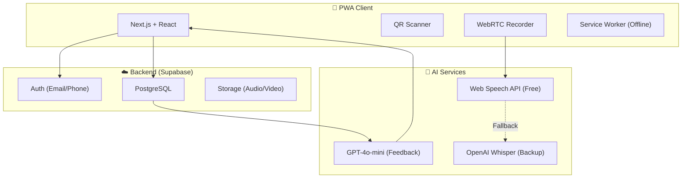
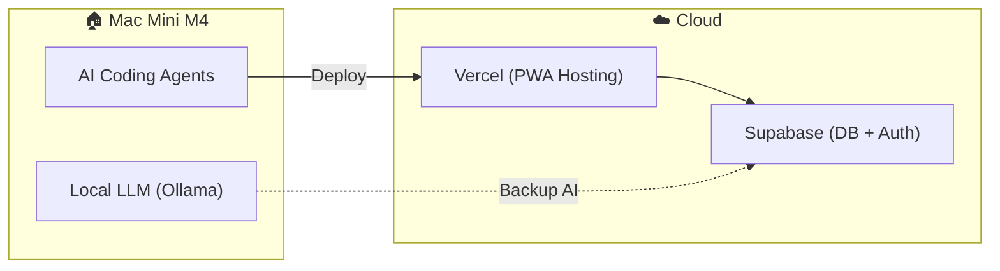

# Resource & Cost Estimation: MATE Project (v3.0)

**Role:** Solution Architect  
**Date:** 2026-02-02  
**Version:** 3.0 (AI Agent-First Development)

---

## 1. Kiến trúc Giải pháp (Solution Architecture)

### Tech Stack

| Layer             | Công nghệ                           | Lý do chọn                         |
| :---------------- | :---------------------------------- | :--------------------------------- |
| **Frontend**      | Next.js 14 (App Router)             | PWA-ready, SEO, Performance        |
| **Styling**       | Tailwind CSS + shadcn/ui            | Rapid UI Development               |
| **Backend**       | Supabase                            | Auth, Database, Storage all-in-one |
| **AI - Speech**   | Web Speech API → Whisper (fallback) | Free first, accurate when needed   |
| **AI - Feedback** | OpenAI GPT-4o-mini                  | Cost-effective, fast               |
| **Hosting**       | Vercel + Supabase Cloud             | Zero DevOps overhead               |

---

## 2. Ước lượng Thời gian (AI Agent-First Development)

> **Mô hình phát triển:** Sử dụng AI Agents (OpenClaw/Claude, Google Antigravity, Cursor) làm "lập trình viên ảo" chính, con người chỉ đóng vai trò giám sát và review code.

### Man-Days Breakdown

| Epic                 | Features                                    | AI Agent (MD) | Human Review (MD) |  Tổng (MD)  |
| :------------------- | :------------------------------------------ | :-----------: | :---------------: | :---------: |
| **1. Auth & Core**   | PWA setup, Login, Guest Mode                |       1       |        0.5        |   **1.5**   |
| **2. Dashboard**     | Daily Quest, Growth Tree, Nav               |       1       |        0.5        |   **1.5**   |
| **3. Learning Core** | QR Scanner, Flashcards, Media Player, Timer |       2       |         1         |    **3**    |
| **4. AI Features**   | AI Speaking, Virtual Partner                |       3       |         1         |    **4**    |
| **5. Gamification**  | Postcard Generator, Tree Animation          |       1       |        0.5        |   **1.5**   |
| **6. Support**       | Community, Guide, Founder Corner            |      0.5      |        0.5        |    **1**    |
| **7. Testing**       | QA, PWA Offline, Bug fixes                  |       2       |         1         |    **3**    |
| **Buffer**           | Unexpected issues (20%)                     |       -       |         -         |    **3**    |
| **Tổng**             |                                             |  **10.5 MD**  |     **5 MD**      | **18.5 MD** |

### Timeline (AI Agent-First)

| Phase       | Nội dung                        |  Thời gian   |
| :---------- | :------------------------------ | :----------: |
| **Phase 0** | Discovery & Content Prep        |   2-3 ngày   |
| **Phase 1** | Core MVP (Auth + Learning + QR) |    1 tuần    |
| **Phase 2** | AI Features                     |    1 tuần    |
| **Phase 3** | Gamification + Polish           |   3-4 ngày   |
| **Phase 4** | Testing & Launch                |   2-3 ngày   |
| **Tổng**    |                                 | **3-4 Tuần** |

---

## 3. Chi phí Hạ tầng (OPEX) - So sánh Phương án

### **Phương án A: Cloud-First (Vercel + Supabase)**

Phù hợp cho: Startup, MVP, team nhỏ, không muốn quản lý hạ tầng.

| Hạng mục        | Dịch vụ            |    Chi phí/tháng |
| :-------------- | :----------------- | ---------------: |
| Hosting         | Vercel Pro         |              $20 |
| Database + Auth | Supabase Pro       |              $25 |
| AI (Feedback)   | OpenAI GPT-4o-mini |           $30-50 |
| Storage         | Supabase Storage   |    $0 (1GB free) |
| Domain          | .com               |              ~$1 |
| **Tổng OPEX**   |                    | **$76-96/tháng** |

**Ưu điểm:** Zero DevOps, auto-scale, uptime cao.  
**Nhược điểm:** Chi phí tăng dần khi scale, phụ thuộc vendor.

---

### **Phương án B: Self-Hosted Server (Mac Mini M4)**

Phù hợp cho: Long-term investment, kiểm soát chi phí, chạy AI Agents local.

#### Chi phí Một lần (CAPEX)

| Thiết bị                       | Cấu hình            |         Giá (USD) | Ghi chú             |
| :----------------------------- | :------------------ | ----------------: | :------------------ |
| **Mac Mini M4**                | 24GB RAM, 512GB SSD |             ~$800 | Server chính        |
| **Mac Mini M4 Pro** (Optional) | 48GB RAM, 512GB SSD |           ~$1,400 | Nếu chạy LLM local  |
| UPS (Lưu điện)                 | 600VA               |              ~$50 | Bảo vệ khi mất điện |
| External SSD                   | 1TB                 |              ~$80 | Backup              |
| **Tổng CAPEX**                 |                     | **$930 - $1,530** |                     |

#### Chi phí Vận hành (OPEX)

| Hạng mục              |    Chi phí/tháng |
| :-------------------- | ---------------: |
| Điện (~50W x 24h)     |              ~$5 |
| Internet tĩnh IP      |           $10-20 |
| Domain + SSL          |              ~$1 |
| OpenAI API (Feedback) |           $30-50 |
| **Tổng OPEX**         | **$46-76/tháng** |

**Ưu điểm:**

- Chi phí dài hạn thấp hơn (ROI sau ~12 tháng)
- Có thể chạy AI Agents (OpenClaw, Ollama) local
- Kiểm soát hoàn toàn data
- Không giới hạn bandwidth/storage

**Nhược điểm:**

- Cần người quản trị (hoặc AI Agent quản trị)
- Uptime phụ thuộc điện + internet
- Khó scale nếu đột ngột tăng traffic

---

### **Phương án C: Hybrid (Cloud + Local AI Server)**

Kết hợp tốt nhất của cả hai.

| Hạng mục                | Dịch vụ         |       Chi phí |
| :---------------------- | :-------------- | ------------: |
| PWA Hosting             | Vercel Free/Pro |   $0-20/tháng |
| Database                | Supabase Free   |      $0/tháng |
| AI Server (Mac Mini M4) | One-time        |          $800 |
| AI API (OpenAI)         | Pay-as-you-go   |  $30-50/tháng |
| **Tổng Year 1**         |                 |   **~$1,200** |
| **Tổng Year 2+**        |                 | **~$400/năm** |

**Recommendation:** ✅ Phương án C là tối ưu nhất cho dự án này.

---

### So sánh Tổng hợp

| Tiêu chí            | Cloud-First | Self-Hosted |   Hybrid   |
| :------------------ | :---------: | :---------: | :--------: |
| Chi phí năm 1       |   ~$1,150   |   ~$1,400   |  ~$1,200   |
| Chi phí năm 2+      | ~$1,150/năm |  ~$600/năm  | ~$400/năm  |
| DevOps Effort       |    Thấp     |     Cao     | Trung bình |
| Chạy AI Agent local |     ❌      |     ✅      |     ✅     |
| Scale dễ dàng       |     ✅      |     ❌      |     ✅     |
| Data Privacy        | Trung bình  |     Cao     |    Cao     |

---

## 4. Chi phí Phát triển (CAPEX)

### **Phương án 1: Thuê Developer (Truyền thống)**

| Vai trò               |   Thời gian   |         Rate |    Chi phí |
| :-------------------- | :-----------: | -----------: | ---------: |
| Fullstack Dev + AI    |   1.5 tháng   | $2,500/tháng |     $3,750 |
| UI/UX Detail          | Project-based |            - |       $800 |
| Content (Audio/Cards) | Project-based |            - |       $500 |
| QA & Testing          |   0.5 tháng   | $1,000/tháng |       $500 |
| Project Management    |   Part-time   |            - |       $500 |
| **Tổng**              |               |              | **$6,050** |

---

### **Phương án 2: AI Agent-First (Recommended ✅)**

Mô hình này sử dụng AI Agents làm "lập trình viên chính", con người chỉ cần:

- Viết requirements (User Stories)
- Review code
- Test sản phẩm

#### Thiết bị cần thiết

| Thiết bị                         | Mục đích                   |           Giá (USD) |
| :------------------------------- | :------------------------- | ------------------: |
| **Mac Mini M4 (24GB)**           | AI Coding Server + Hosting |                $800 |
| **MacBook Air M2/M3** (Optional) | Máy cho PM/Reviewer        |          $999-1,199 |
| Monitor + Keyboard               | Cho lập trình viên         |                $200 |
| **Tổng Hardware**                |                            | **$1,000 - $2,200** |

#### Chi phí AI Services

| Dịch vụ                       | Mục đích               |     Chi phí/tháng |
| :---------------------------- | :--------------------- | ----------------: |
| **Claude Pro (Anthropic)**    | AI Coding Agent chính  |               $20 |
| **Cursor Pro**                | IDE + AI Code          |               $20 |
| **OpenAI API**                | Backup + Production AI |            $30-50 |
| **GitHub Copilot** (Optional) | Code suggestions       |               $10 |
| **Tổng AI Services**          |                        | **$60-100/tháng** |

#### Nhân sự (Giảm thiểu)

| Vai trò                          | Mô tả                        |  Chi phí |
| :------------------------------- | :--------------------------- | -------: |
| **Technical PM / Code Reviewer** | Part-time, 10h/tuần x 4 tuần |     $500 |
| Content Creator                  | Audio recording, Card data   |     $300 |
| **Tổng Nhân sự**                 |                              | **$800** |

#### Tổng CAPEX (AI Agent-First)

| Hạng mục                          |    Chi phí |
| :-------------------------------- | ---------: |
| Hardware (Mac Mini + Accessories) |     $1,000 |
| AI Services (3 tháng)             |       $240 |
| Nhân sự (PM + Content)            |       $800 |
| **Tổng CAPEX**                    | **$2,040** |

**=> Tiết kiệm: $4,000 so với phương án thuê Developer truyền thống!**

---

### So sánh Phương án Phát triển

| Tiêu chí            |    Thuê Dev    |    AI Agent-First    |
| :------------------ | :------------: | :------------------: |
| **Chi phí**         |     $6,050     |        $2,040        |
| **Thời gian**       |    5-6 tuần    |       3-4 tuần       |
| **Rủi ro nhân sự**  | Cao (Dev nghỉ) |         Thấp         |
| **Chất lượng code** | Phụ thuộc Dev  |      Consistent      |
| **Tái sử dụng**     |       ❌       | ✅ (Có server riêng) |
| **Maintenance**     |    Cần Dev     |   AI có thể tự fix   |

---

## 5. Phân tích Rủi ro (Risk Assessment)

| Rủi ro                                 |  Xác suất  |   Impact   | Mitigation                     |
| :------------------------------------- | :--------: | :--------: | :----------------------------- |
| QR Scanner chậm trên iOS Safari        |    Cao     |    Cao     | Fallback: Nhập mã thủ công     |
| Web Speech API không hỗ trợ tiếng Việt | Trung bình |    Cao     | Dùng Whisper API               |
| Supabase Free Tier limit               |    Cao     | Trung bình | Monitor usage, archive data    |
| AI Agent tạo bug                       | Trung bình | Trung bình | Human review + automated tests |
| Mac Mini hỏng                          |    Thấp    |    Cao     | Backup to Cloud, UPS           |

---

## 6. Khuyến nghị MVP

### Features PHẢI CÓ (Must-Have)

- [x] Guest Mode + Member Login
- [x] QR Scanner + Manual Input
- [x] Flashcard Learning (Vocab/Grammar)
- [x] Media Player (Audio/Video)
- [x] AI Speaking Feedback (Traffic Light)
- [x] Daily Quest Progress

### Features NÊN CÓ (Nice-to-Have)

- [ ] Growth Tree Animation
- [ ] Postcard Report (có thể đơn giản hoá)
- [ ] Virtual Partner (Phase 2)

### Features BỎ HOẶC HOÃN

- [ ] Video Recording (Final Station) → Chỉ ghi âm
- [ ] Improv Challenge → Phase 2
- [ ] Community Integration → Link external

---

## 7. Maintenance (Post-Launch)

| Hạng mục                 |        Cloud |  Self-Hosted |
| :----------------------- | -----------: | -----------: |
| Infrastructure           |       $76-96 |       $46-76 |
| AI Services (Production) |       $30-50 |       $30-50 |
| Bug fixes (AI Agent)     |          $20 |          $20 |
| Human Review (4h/tháng)  |          $50 |          $50 |
| **Tổng/tháng**           | **$176-216** | **$146-196** |

---

## 8. Kết luận & Khuyến nghị

### ✅ Recommendation: AI Agent-First + Hybrid Infrastructure

| Hạng mục             | Recommendation                                         |
| :------------------- | :----------------------------------------------------- |
| **Infrastructure**   | Phương án C (Hybrid) - Mac Mini M4 + Vercel + Supabase |
| **Development**      | AI Agent-First với OpenClaw/Claude + Cursor            |
| **Total Investment** | ~$2,000 - $2,500 CAPEX                                 |
| **Timeline**         | 3-4 tuần                                               |
| **Monthly Running**  | ~$150-200/tháng                                        |

### ROI Analysis

- Đầu tư ban đầu: ~$2,500
- Chi phí vận hành: ~$200/tháng
- Break-even với Cloud-only: 6 tháng
- **Long-term savings: $600-800/năm**

---

_Document Version: 3.0 | AI Agent-First Development Model_
