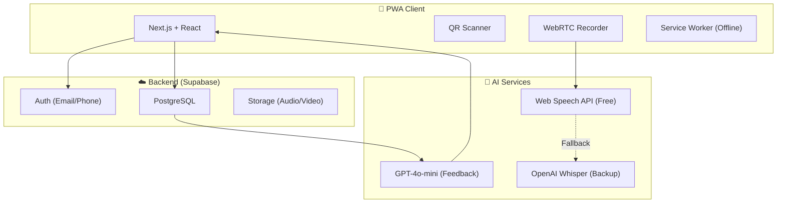

# Resource & Cost Estimation: MATE Project (v2.0)

**Role:** Solution Architect  
**Date:** 2026-02-02  
**Version:** 2.0 (AI-Assisted Development)

---

## 1. Kiến trúc Giải pháp (Solution Architecture)

### Tech Stack

| Layer             | Công nghệ                           | Lý do chọn                         |
| :---------------- | :---------------------------------- | :--------------------------------- |
| **Frontend**      | Next.js 14 (App Router)             | PWA-ready, SEO, Performance        |
| **Styling**       | Tailwind CSS + shadcn/ui            | Rapid UI Development               |
| **Backend**       | Supabase                            | Auth, Database, Storage all-in-one |
| **AI - Speech**   | Web Speech API → Whisper (fallback) | Free first, accurate when needed   |
| **AI - Feedback** | OpenAI GPT-4o-mini                  | Cost-effective, fast               |
| **Hosting**       | Vercel + Supabase Cloud             | Zero DevOps overhead               |

---

## 2. Ước lượng Thời gian (AI-Assisted Development)

> **Lưu ý:** Với sự hỗ trợ của AI Agents (Claude, Cursor, v1, etc.), năng suất coding tăng **2-3x** so với truyền thống.

### Man-Days Breakdown

| Epic                 | Features                                    | Complexity | Traditional (MD) | AI-Assisted (MD) |
| :------------------- | :------------------------------------------ | :--------: | :--------------: | :--------------: |
| **1. Auth & Core**   | PWA setup, Login, Guest Mode                |   Medium   |        6         |      **3**       |
| **2. Dashboard**     | Daily Quest, Growth Tree, Nav               |   Medium   |        6         |      **3**       |
| **3. Learning Core** | QR Scanner, Flashcards, Media Player, Timer |    High    |        10        |      **5**       |
| **4. AI Features**   | AI Speaking, Virtual Partner                | Very High  |        12        |      **7**       |
| **5. Gamification**  | Postcard Generator, Tree Animation          |   Medium   |        6         |      **3**       |
| **6. Support**       | Community, Guide, Founder Corner            |    Low     |        3         |      **2**       |
| **7. Testing**       | QA, PWA Offline, Bug fixes                  |     -      |        5         |      **4**       |
| **Buffer**           | Unexpected issues (15%)                     |     -      |        -         |      **4**       |
| **Tổng**             |                                             |            |    **48 MD**     |    **31 MD**     |

### Timeline (Realistic)

| Phase       | Nội dung                        |  Thời gian   |
| :---------- | :------------------------------ | :----------: |
| **Phase 0** | Discovery & Content Prep        |   3-5 ngày   |
| **Phase 1** | Core MVP (Auth + Learning + QR) |    2 tuần    |
| **Phase 2** | AI Features                     |   1.5 tuần   |
| **Phase 3** | Gamification + Polish           |    1 tuần    |
| **Phase 4** | Testing & Launch                |   3-5 ngày   |
| **Tổng**    |                                 | **5-6 Tuần** |

---

## 3. Chi phí Hạ tầng (Monthly OPEX)

Dự toán cho **1,000 MAU** (Monthly Active Users).

| Hạng mục        | Dịch vụ            | Tier          |    Chi phí/tháng | Ghi chú                |
| :-------------- | :----------------- | :------------ | ---------------: | :--------------------- |
| Hosting         | Vercel             | Pro           |              $20 | Free tier đủ cho MVP   |
| Database + Auth | Supabase           | Pro           |              $25 | Free: 500MB, 50K users |
| AI (Speaking)   | Web Speech API     | Free          |               $0 | Built-in browser       |
| AI (Feedback)   | OpenAI GPT-4o-mini | Pay-as-you-go |           $30-50 | ~1000 postcards/tháng  |
| Storage         | Supabase Storage   | Included      |               $0 | First 1GB free         |
| Domain          | .com               | Yearly        |              ~$1 |                        |
| **Tổng OPEX**   |                    |               | **$76-96/tháng** | ~2 triệu VNĐ           |

### Scaling Cost (10,000 MAU)

| Hạng mục       |       Chi phí/tháng |
| :------------- | ------------------: |
| Vercel Pro     |                 $20 |
| Supabase Pro   |                 $25 |
| AI Feedback    |            $300-500 |
| Storage (10GB) |                 $25 |
| **Tổng**       | **~$400-600/tháng** |

---

## 4. Chi phí Phát triển (CAPEX)

### Nhân sự (AI-Assisted Model)

| Vai trò                   |   Thời gian   |         Rate |    Chi phí |
| :------------------------ | :-----------: | -----------: | ---------: |
| **Fullstack Dev + AI**    |   1.5 tháng   | $2,500/tháng |     $3,750 |
| **UI/UX Detail**          | Project-based |            - |       $800 |
| **Content (Audio/Cards)** | Project-based |            - |       $500 |
| **QA & Testing**          |   0.5 tháng   | $1,000/tháng |       $500 |
| **Project Management**    |   Part-time   |            - |       $500 |
| **Tổng CAPEX**            |               |              | **$6,050** |

**=> Tổng chi phí phát triển: ~$6,000 - $7,000 (150 - 175 triệu VNĐ)**

---

## 5. Phân tích Rủi ro (Risk Assessment)

| Rủi ro                                 |  Xác suất  |   Impact   | Mitigation                          |
| :------------------------------------- | :--------: | :--------: | :---------------------------------- |
| QR Scanner chậm trên iOS Safari        |    Cao     |    Cao     | Fallback: Nhập mã thủ công          |
| Web Speech API không hỗ trợ tiếng Việt | Trung bình |    Cao     | Dùng Whisper API                    |
| Supabase Free Tier limit               |    Cao     | Trung bình | Monitor usage, archive data         |
| PWA Offline sync conflict              | Trung bình | Trung bình | IndexedDB + conflict resolution     |
| User adoption thấp                     | Trung bình |    Cao     | A/B test features, collect feedback |

---

## 6. Khuyến nghị MVP (Minimum Viable Product)

### Features PHẢI CÓ (Must-Have)

- [x] Guest Mode + Member Login
- [x] QR Scanner + Manual Input
- [x] Flashcard Learning (Vocab/Grammar)
- [x] Media Player (Audio/Video)
- [x] AI Speaking Feedback (Traffic Light)
- [x] Daily Quest Progress

### Features NÊN CÓ (Nice-to-Have)

- [ ] Growth Tree Animation
- [ ] Postcard Report (có thể đơn giản hoá)
- [ ] Virtual Partner (Phase 2)

### Features BỎ HOẶC HOÃN

- [ ] Video Recording (Final Station) → Chỉ ghi âm
- [ ] Improv Challenge → Phase 2
- [ ] Community Integration → Link external

---

## 7. Maintenance (Post-Launch)

| Hạng mục                   |   Chi phí/tháng |
| :------------------------- | --------------: |
| Infrastructure (OPEX)      |          $76-96 |
| Minor bug fixes (4h/tháng) |            $100 |
| Monitoring & Support       |             $50 |
| **Tổng Maintenance**       | **~$250/tháng** |

---

_Document Version: 2.0 | AI-Assisted Development Model_
