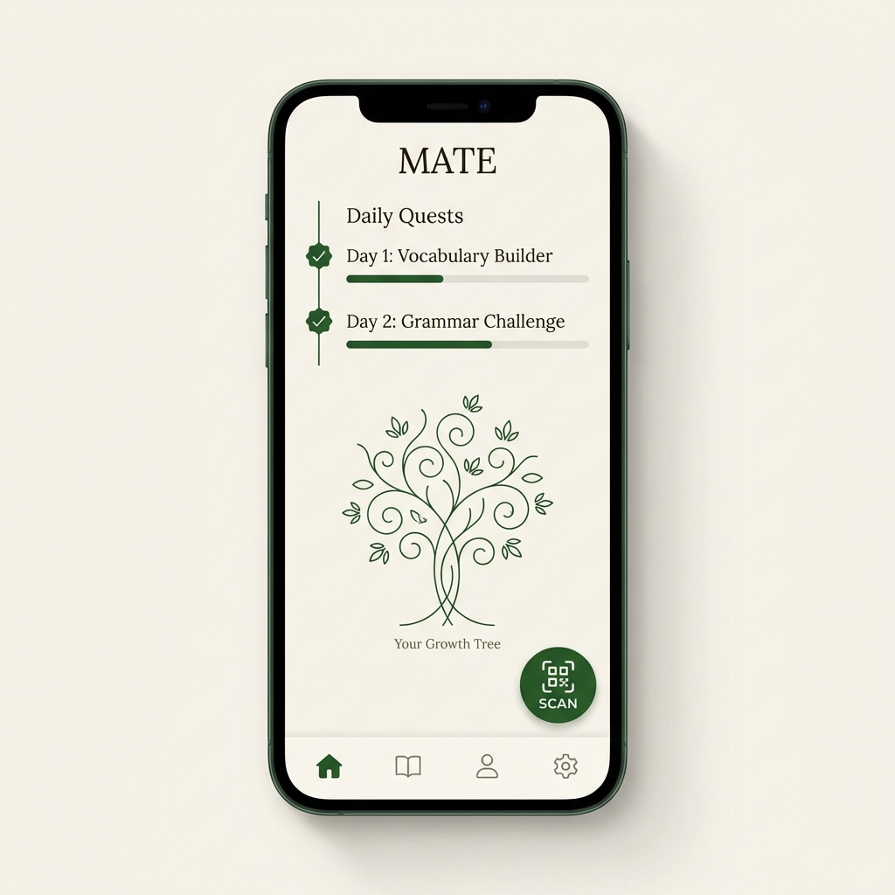
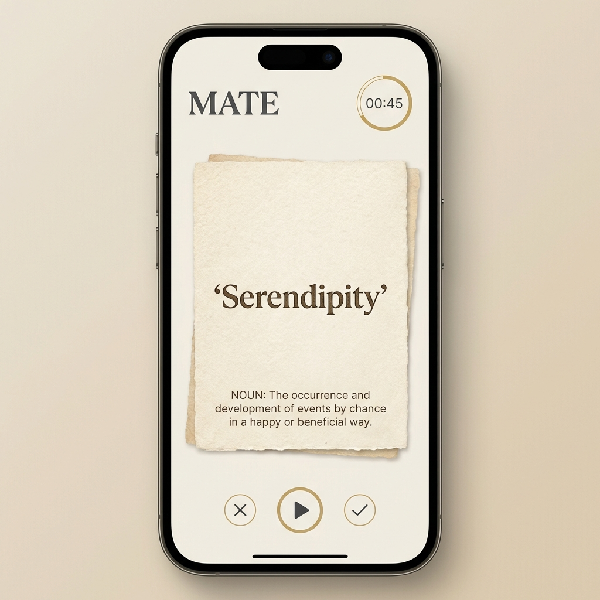
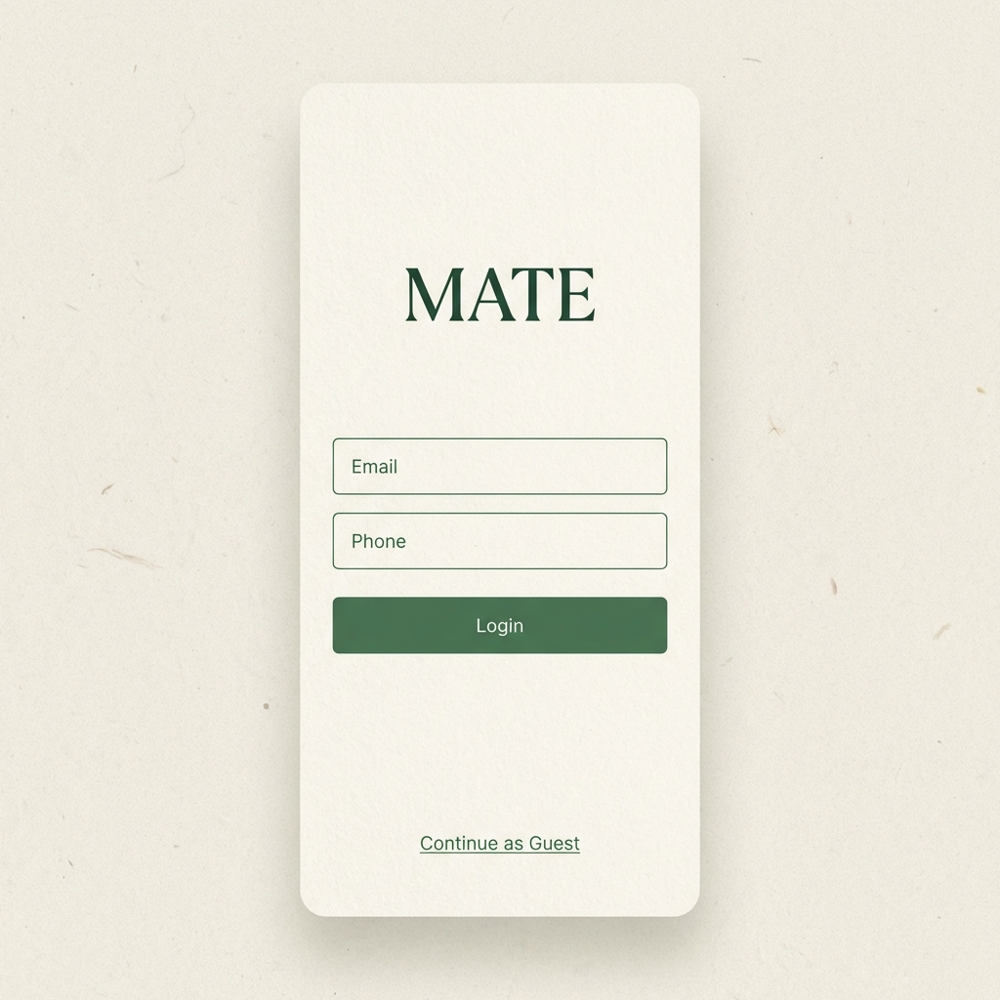
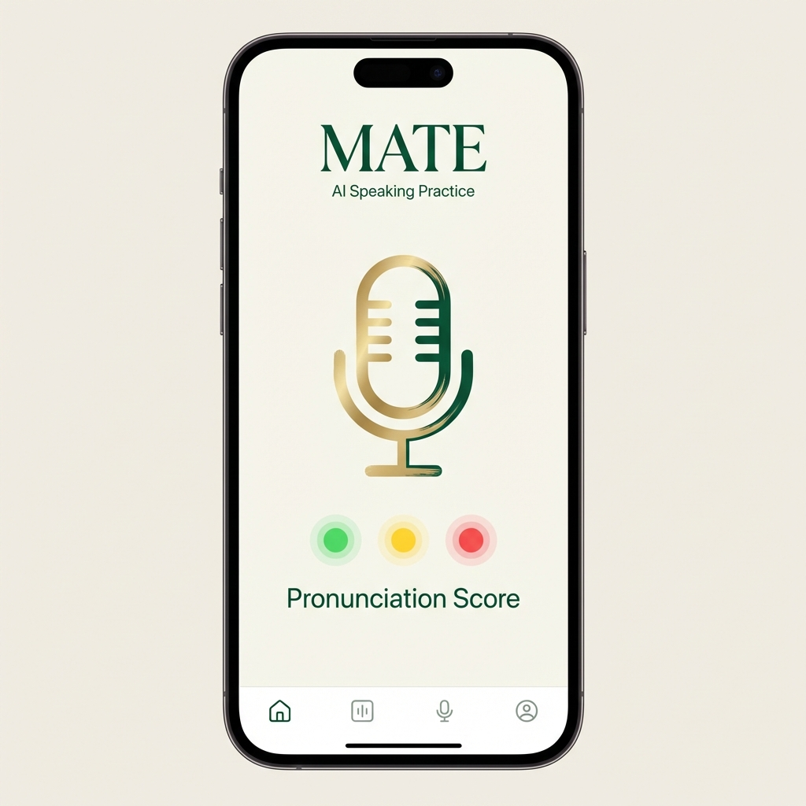

# MATE App - UI Design Concepts

Dưới đây là các bản phác thảo giao diện sơ bộ dựa trên phong cách **Modern-Heritage** (Hiện đại kết hợp cổ điển) mà anh đã đề xuất.

## 1. Màn hình chính (Home Dashboard)

Giao diện tập trung vào sự tối giản, sử dụng tông màu kem ấm (Creamy White) và xanh rêu (Forest Green).

- **Daily Quests:** Dạng Timeline dọc, giúp người học dễ dàng theo dõi lộ trình.
- **The Growth Tree:** Cây ngôn ngữ được vẽ nét mảnh (Line art), tinh tế.
- **Floating QR:** Nút quét mã QR trôi nổi, thuận tiện cho việc tương tác với thẻ vật lý.

## 2. Giao diện Học tập (Learning Station)

Mô phỏng cảm giác của thẻ giấy thật trên nền kỹ thuật số.

- **Digital Card:** Hiệu ứng giấy có vân (Texture), font chữ Serif có chân sang trọng.
- **Timer:** Đồng hồ đếm ngược tinh gọn.
- **Interaction:** Các nút điều khiển tối giản để không làm phân tâm.

## 3. Màn hình Đăng nhập (Login & Onboarding)

Thiết kế tạo cảm giác chào đón, tin cậy.

- **Minimalist Inputs:** Các trường nhập liệu gọn gàng.
- **Guest Option:** Lựa chọn "Continue as Guest" rõ ràng cho người dùng mới.

## 4. Luyện phát âm AI (AI Speaking Feedback)

Giao diện phản hồi trực quan, dễ hiểu.

- **Visual Feedback:** Hệ thống "Đèn giao thông" (Xanh/Vàng/Đỏ) báo hiệu độ chính xác ngay lập tức.
- **Microphone Icon:** Nút ghi âm lớn, dễ thao tác.

## 5. Báo cáo & Gamification (Postcard Report)

Phần thưởng tinh thần cho người học.

- **Postcard Aesthetics:** Thiết kế như một tấm bưu thiếp cổ điển, tạo giá trị sưu tầm.
- **Stamp:** Con tem "Growth Tree" chứng nhận sự trưởng thành.
- **Shareable:** Tối ưu để chia sẻ lên mạng xã hội.

